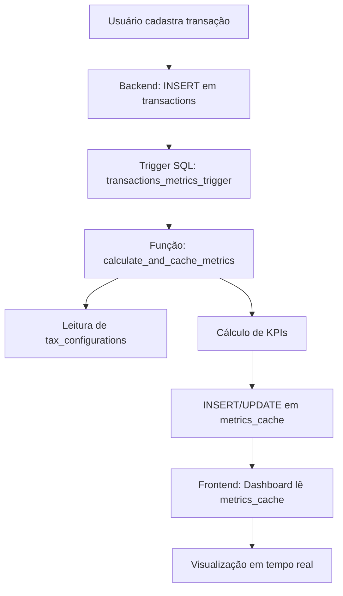

# Arquitetura do DRE Infinity Spark

## Visão Geral

O **DRE Infinity Spark** é uma plataforma completa de gestão financeira empresarial que calcula automaticamente a Demonstração do Resultado do Exercício (DRE) e métricas avançadas de negócios.

## Fluxo de Dados



## Fluxo de Atualização Automática de Métricas

**Como funciona o sistema de cache automático:**

1. **Usuário cria/edita/deleta transação** em `/transactions`
2. **PostgreSQL trigger `transactions_metrics_trigger` dispara automaticamente** (AFTER INSERT/UPDATE/DELETE)
3. **Função SQL `trigger_recalculate_metrics()` é executada**
4. **Função SQL `calculate_and_cache_metrics()` recalcula TODAS as métricas:**
   - 📊 CAC, LTV, LTV/CAC Ratio
   - 💰 ROI, Average Ticket
   - ⚖️ Break-Even Point, Safety Margin
   - 💸 Fixed/Variable Costs, Tax Deductions
5. **Resultados são salvos em `metrics_cache`** com timestamp em `last_calculated_at`
6. **Dashboard lê `metrics_cache` via `useMetricsCache` hook** e exibe em tempo real
7. **✅ Nenhum recálculo manual necessário!**

**Vantagens:**
- ⚡ Performance: Dashboard carrega instantaneamente
- 🔄 Sempre atualizado: Dados sincronizados automaticamente
- 🛡️ Consistência: Cálculos únicos no backend (evita discrepâncias)

### Detalhamento do Fluxo

1. **Cadastro de Transação** (`/transactions`)
   - Usuário cria uma transação com categoria, valor e data
   - O frontend valida os dados e envia ao Supabase

2. **Persistência no Banco** (`transactions` table)
   - Transação é inserida com campos:
     - `company_id`, `category_id`, `amount`, `transaction_date`
     - `is_marketing_cost`, `is_sales_cost`, `is_new_client`
     - `month`, `year` (auto-populados via trigger)

3. **Trigger Automático**
   - Trigger `transactions_metrics_trigger` dispara APÓS INSERT/UPDATE/DELETE
   - Chama função `trigger_recalculate_metrics()`

4. **Cálculo de Métricas**
   - Função `calculate_and_cache_metrics(company_id, month, year)`:
     - Busca `tax_configurations` para alíquotas corretas
     - Soma receitas, custos e despesas por categoria
     - Calcula CAC, LTV, ROI, Ponto de Equilíbrio
     - Salva em `metrics_cache`

5. **Exibição no Frontend**
   - Dashboard lê `metrics_cache` via hook `useMetricsCache`
   - DRE lê via hook `useDRE`
   - Gráficos e KPIs são atualizados automaticamente

---

## Cálculo da DRE

### Estrutura da DRE

```
Receita Bruta
(-) Deduções (Impostos)
= Receita Líquida
(-) CMV (Custo de Mercadoria Vendida)
= Lucro Bruto
(-) Despesas Operacionais
= Lucro Operacional (EBIT)
(-) IR/CSLL
= Lucro Líquido
```

### Fórmulas Implementadas

#### 1. Receita Bruta
```sql
SELECT SUM(amount) 
FROM transactions 
WHERE category_type = 'revenue'
```

#### 2. Deduções (Impostos)
```sql
-- Se usar DAS (Simples Nacional):
deduções = receita_bruta * das_rate

-- Senão (Lucro Presumido/Real):
deduções = receita_bruta * (icms + ipi + pis + cofins + iss)
```
**Fonte:** `tax_configurations` table

#### 3. Receita Líquida
```
receita_líquida = receita_bruta - deduções
```

#### 4. CMV (Custo de Mercadoria Vendida)
```sql
SELECT SUM(amount) 
FROM transactions 
WHERE category_type = 'cost'
```

#### 5. Lucro Bruto
```
lucro_bruto = receita_líquida - cmv
```

#### 6. Despesas Operacionais
```sql
SELECT SUM(amount) 
FROM transactions 
WHERE category_type = 'expense'
```

#### 7. Lucro Operacional (EBIT)
```
lucro_operacional = lucro_bruto - despesas_operacionais
```

#### 8. Lucro Líquido
```
lucro_líquido = lucro_operacional - ir_csll
```
*Nota: IR e CSLL são calculados sobre o lucro operacional*

---

## Cálculo de Métricas Avançadas

### 1. CAC (Custo de Aquisição de Cliente)
```
CAC = (Marketing Costs + Sales Costs) / New Clients Count
```

**Exemplo:**
- Marketing: R$ 5.000
- Vendas: R$ 3.000
- Novos Clientes: 10
- **CAC = R$ 800**

**Fonte de Dados:**
- `transactions` onde `is_marketing_cost = true` OU `is_sales_cost = true`
- `transactions` onde `is_new_client = true` e `client_id IS NOT NULL`

---

### 2. LTV (Lifetime Value)
```
LTV = Average Ticket × 12 meses
```

**Exemplo:**
- Ticket Médio: R$ 1.200
- **LTV = R$ 14.400**

**Nota:** Assumimos retenção de 12 meses (simplificado). Em produção, seria calculado com base no histórico real de recompra.

---

### 3. LTV/CAC Ratio
```
LTV/CAC Ratio = LTV / CAC
```

**Exemplo:**
- LTV: R$ 14.400
- CAC: R$ 800
- **Ratio = 18:1**

**Interpretação:**
- ✅ **> 3:1** → Saudável (cliente retorna 3x o custo de aquisição)
- ⚠️ **< 3:1** → Atenção (pode indicar problema de retenção ou marketing caro)

---

### 4. ROI (Return on Investment)
```
ROI = ((Net Revenue - Total Costs) / Total Costs) × 100
```

**Exemplo:**
- Receita Líquida: R$ 50.000
- Custos Totais: R$ 30.000
- **ROI = 66,7%**

---

### 5. Average Ticket (Ticket Médio)
```
Average Ticket = Total Revenue / Total Sales Count
```

**Exemplo:**
- Receita Total: R$ 100.000
- Número de Vendas: 50
- **Ticket Médio = R$ 2.000**

---

### 6. Break-Even Point (Ponto de Equilíbrio)
```
Break-Even Point = Fixed Costs / Contribution Margin Rate

Onde:
Contribution Margin = Net Revenue - Variable Costs
Contribution Margin Rate = Contribution Margin / Net Revenue
```

**Exemplo:**
- Receita Líquida: R$ 100.000
- Custos Variáveis: R$ 40.000
- Custos Fixos: R$ 30.000
- Margem de Contribuição: R$ 60.000
- Taxa de MC: 60%
- **Ponto de Equilíbrio = R$ 50.000**

**Interpretação:** A empresa precisa faturar R$ 50.000 para cobrir todos os custos fixos.

---

### 7. Safety Margin (Margem de Segurança)
```
Safety Margin % = ((Net Revenue - Break-Even Point) / Net Revenue) × 100
```

**Exemplo:**
- Receita Líquida: R$ 100.000
- Ponto de Equilíbrio: R$ 50.000
- **Margem de Segurança = 50%**

**Interpretação:** A receita pode cair 50% antes da empresa entrar no prejuízo.

---

## Estrutura de Banco de Dados

### Tabelas Principais

#### `transactions`
- Armazena TODAS as movimentações financeiras
- Campos críticos:
  - `category_id` → FK para `dre_categories`
  - `is_marketing_cost`, `is_sales_cost` → Para cálculo de CAC
  - `is_new_client` → Para identificar novos clientes
  - `client_id` → FK para `clients`

#### `dre_categories`
- Define as categorias da DRE
- Tipos: `revenue`, `cost`, `expense`
- Classificação: `fixed`, `variable`

#### `metrics_cache`
- **Cache de métricas calculadas por período**
- Evita recálculo em toda visualização do Dashboard
- Atualizado automaticamente via trigger

#### `tax_configurations`
- Alíquotas de impostos por empresa
- `use_das` → Se usa DAS (Simples Nacional)
- Taxas individuais: ICMS, IPI, PIS, COFINS, ISS

---

## Integração Backend/Frontend

### Hooks Principais

#### `useMetricsCache(month?, year?)`
- Busca métricas cacheadas do backend
- Retorna: `metricsCache`, `loading`, `lastUpdated`
- Usado no **Dashboard** para KPIs

#### `useDRE(month, year)`
- Calcula DRE completa no frontend
- Lê `transactions` e `tax_configurations`
- Usado na página **DRE/Relatórios**

#### `useTaxConfigurations()`
- Busca e atualiza configurações de impostos
- Usado em **Configurações > % AV**

---

## Módulos do Sistema

### 1. Dashboard (`/dashboard`)
- **KPIs Principais:** Lucro Líquido, Receita Líquida, CAC, LTV, ROI
- **Gráficos:**
  - Evolução do Lucro Líquido (12 meses)
  - Funil de Composição da Receita
  - Evolução de CAC e LTV
  - Indicadores de Metas

### 2. DRE/Relatórios (`/reports`)
- DRE completa com Análise Vertical (% AV)
- Análise Horizontal (% AH) - comparação mensal
- Exportação para Excel

### 3. Lançamentos (`/transactions`)
- Cadastro de transações
- Filtros por período, categoria, cliente
- Marcação de custos de marketing/vendas

### 4. Metas e Orçamento (`/goals`)
- Definição de metas por métrica
- Comparação Realizado vs Meta
- Indicadores de progresso

### 5. Ponto de Equilíbrio (`/break-even`)
- Cálculo de Break-Even Point
- Gráfico de Margem de Segurança
- Análise de Contribuição Marginal

### 6. Cenários (`/scenarios`)
- Simulação de aumento/redução de receitas
- Simulação de aumento/redução de custos
- Projeções de impacto no lucro

### 7. Configurações (`/settings`)
- **Conta:** Edição de dados da empresa
- **% AV (Análise Vertical):** Configuração de alíquotas
- Gestão de múltiplas empresas

---

## Segurança e RLS (Row-Level Security)

### Políticas Implementadas

#### `transactions`
```sql
-- Usuários só veem transações de suas empresas
WHERE EXISTS (
  SELECT 1 FROM companies 
  WHERE companies.id = transactions.company_id 
  AND companies.owner_id = auth.uid()
)
```

#### `metrics_cache`
```sql
-- Apenas leitura, inserção via trigger SQL
POLICY FOR SELECT WHERE company_owner = auth.uid()
```

#### `tax_configurations`
```sql
-- Usuários podem editar configurações de suas empresas
POLICY FOR ALL WHERE company_owner = auth.uid()
```

---

## Performance e Otimizações

### 1. Cache de Métricas
- **Problema:** Recalcular métricas em toda visualização é lento
- **Solução:** Tabela `metrics_cache` atualizada via trigger
- **Benefício:** Dashboard carrega instantaneamente

### 2. Índices no Banco
```sql
CREATE INDEX idx_transactions_company_period 
ON transactions(company_id, month, year);

CREATE INDEX idx_transactions_category 
ON transactions(category_id);
```

### 3. React.memo e useMemo
- Componentes de gráfico usam `React.memo` para evitar re-renders
- Cálculos pesados usam `useMemo` para cachear resultados

---

## Troubleshooting

### Dashboard Vazio ou Desatualizado

**Sintoma:** Dashboard não exibe dados após cadastrar transações

**Causa:** `metrics_cache` não foi atualizado

**Solução:**
1. Ir para `/debug-data`
2. Clicar em "🔄 Recalcular Métricas"
3. Verificar se `last_calculated_at` foi atualizado

---

### Transações Sem Categoria

**Sintoma:** Transações não aparecem na DRE

**Causa:** `category_id` é NULL

**Solução:** Migration SQL cria categorias padrão e atualiza transações órfãs

---

### Impostos Errados

**Sintoma:** Deduções não batem com o esperado

**Causa:** `tax_configurations` não está configurado corretamente

**Solução:**
1. Ir para **Configurações > % AV**
2. Ajustar as alíquotas corretas
3. Clicar em "Recalcular Métricas" no Debug

---

## Roadmap Futuro

### Curto Prazo
- [ ] Integração com bancos (Open Banking)
- [ ] Importação de XML/NFe
- [ ] Relatórios em PDF

### Médio Prazo
- [ ] Multi-moeda
- [ ] Fluxo de caixa projetado
- [ ] Análise de tendências com IA

### Longo Prazo
- [ ] Mobile app (React Native)
- [ ] Gestão de estoque
- [ ] CRM integrado

---

## Contato e Suporte

Para dúvidas ou suporte técnico:
- 📧 Email: suporte@infinityspark.com.br
- 💬 Discord: [link]
- 📚 Documentação: https://docs.infinityspark.com.br
